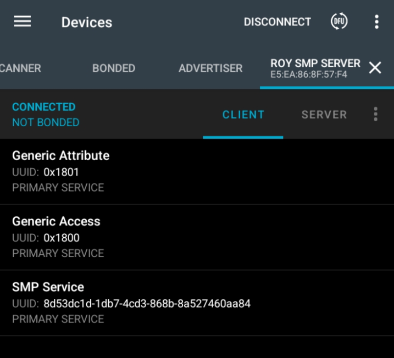
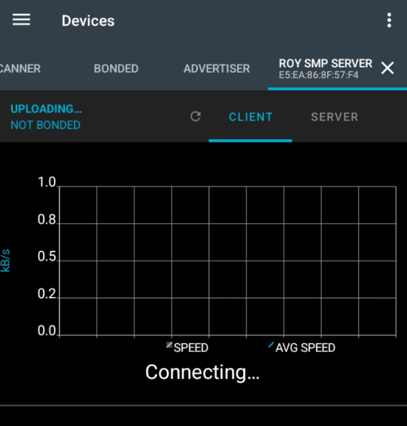

# Getting Started

All the below setups has successfully been built using ncs `v3.0.2` in win11

## Build Normally

```bash
west build --build-dir c:/project-coding/iot/projects/balancer-robot-fw/build c:/project-coding/iot/projects/balancer-robot-fw --pristine --board nrf5340dk/nrf5340/cpuapp -- -DEXTRA_CONF_FILE="debug-overlay.conf" -DDEBUG_THREAD_INFO=Off -Dbalancer-robot-fw_DEBUG_THREAD_INFO=On -Dmcuboot_DEBUG_THREAD_INFO=Off
```

## Build TFM

- Bash command

```bash
west build --build-dir c:/project-coding/iot/projects/balancer-robot-fw/build_ns c:/project-coding/iot/projects/balancer-robot-fw --pristine --board nrf5340dk/nrf5340/cpuapp/ns -- -DEXTRA_CONF_FILE="debug-overlay.conf" -DDEBUG_THREAD_INFO=On -DCONFIG_DEBUG_THREAD_INFO=y -Dbalancer-robot-fw_DEBUG_THREAD_INFO=On -Dmcuboot_DEBUG_THREAD_INFO=Off
```

- Result

```bash
...

-- Cache files will be written to: C:/ncs/v3.0.2/zephyr/.cache
-- Configuring done
-- Generating done
-- Build files have been written to: C:/project-coding/iot/projects/balancer-robot-fw/build_ns/balancer-robot-fw/tfm
[140/144] Linking C executable bin\tfm_s.axf
Memory region         Used Size  Region Size  %age Used
           FLASH:       47996 B      65024 B     73.81%
             RAM:       15044 B        32 KB     45.91%
[17/366] Performing install step for 'tfm'
-- Install configuration: "Debug"
----- Installing platform NS -----
[366/366] Linking CXX executable zephyr\zephyr.elf
Memory region         Used Size  Region Size  %age Used
           FLASH:      185352 B       416 KB     43.51%
             RAM:       86928 B       416 KB     20.41%
        IDT_LIST:          0 GB        32 KB      0.00%
Generating files from C:/project-coding/iot/projects/balancer-robot-fw/build_ns/balancer-robot-fw/zephyr/zephyr.elf for board: nrf5340dk
image.py: sign the payload
image.py: sign the payload
[6/287] Generating include/generated/zephyr/version.h
-- Zephyr version: 4.0.99 (C:/ncs/v3.0.2/zephyr), build: v4.0.99-ncs1-2
[287/287] Linking C executable zephyr\zephyr.elf
Memory region         Used Size  Region Size  %age Used
           FLASH:       38480 B        48 KB     78.29%
             RAM:       22768 B        32 KB     69.48%
        IDT_LIST:          0 GB        32 KB      0.00%
Generating files from C:/project-coding/iot/projects/balancer-robot-fw/build_ns/mcuboot/zephyr/zephyr.elf for board: nrf5340dk
[20/20] Generating ../merged.hex
 *  Terminal will be reused by tasks, press any key to close it.
```

## DFU BLE

- Use nrf connect app
- Scan then connect to it

```bash
# copy to phone
balancer-robot-fw\build\balancer-robot-fw\zephyr\zephyr.signed.bin
```



